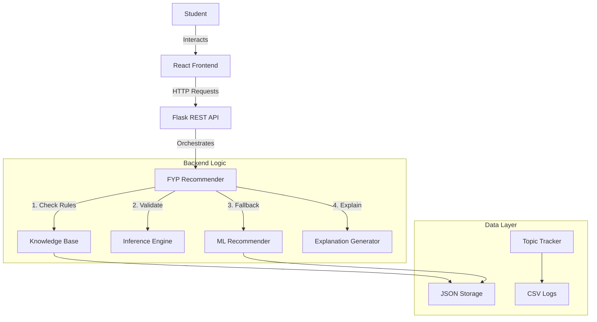

# FYP Recommender System - Project Overview & Presentation Material

This document provides a comprehensive overview of the FYP Recommender System, suitable for creating presentation slides. It covers the problem statement, solution architecture, technical details, and the hybrid recommendation logic.

---

## 1. Project Title & Vision
**Title:** FYP Navigator: A Hybrid Recommender System for Final Year Projects
**Vision:** To bridge the gap between student skills/interests and available Final Year Project (FYP) topics through intelligent, explainable recommendations.

## 2. Problem Statement
- **The Challenge:** Students often struggle to choose FYP topics that align with their actual skills and career interests.
- **The Gap:** Generic lists of topics don't account for a student's technical proficiency or course background.
- **The Consequence:** High dropout rates in projects or poor quality work due to skill mismatches.

## 3. The Solution: "Hybrid Recommender System"
We developed a system that combines two powerful approaches:
1.  **Knowledge-Based Recommender System (KBRS):** Uses explicit expert rules (constraints) to ensure students are *technically qualified* for a topic.
2.  **Machine Learning (ML) Fallback:** Uses Content-Based Filtering (TF-IDF) to find similar topics based on text descriptions when strict rules yield too few results.

## 4. System Architecture

### High-Level Overview
- **Frontend (Client):** A modern, responsive Web App (React + TypeScript).
- **Backend (Server):** A robust REST API (Flask + Python).
- **Intelligence Layer:** specialized Python modules for logic and reasoning.

### Tech Stack
- **Frontend:** React, Vite, Tailwind CSS, Shadcn UI, Recharts.
- **Backend:** Python, Flask, Flask-CORS.
- **Data:** JSON (Storage), CSV (Tracking).
- **ML:** Scikit-learn (TF-IDF Vectorizer, Cosine Similarity).

### Architecture Diagram

## 5. Key backend Modules (The "Brain")

| Module | Role | Key Functionality |
| :--- | :--- | :--- |
| **`recommendation_engine.py`** | The Core Rule Engine | Filters topics based on hard constraints (Required Skills, Courses). Calculates "Match Score". |
| **`inference_engine.py`** | The Feasibility Checker | Infers implicit skills from courses. Calculates "Technical Feasibility" and "Risk Levels". |
| **`ml_recommender.py`** | The Safety Net | Uses TF-IDF to match student Interest profiles with Topic Descriptions if strict rules fail. |
| **`knowledge_base.py`** | The Database | Stores structure data: Domains, Topics, Required Skills, and Rules. |
| **`explanation_generator.py`** | The Storyteller | Generates human-readable "Why this matches" and "Risk Warning" texts. |
| **`api_server.py`** | The Bridge | Exposes Python logic to the Frontend via JSON endpoints. |

## 6. The Recommendation Workflow (The "Algorithm")

1.  **Student Profile Input:** User inputs Major, CGPA, Skills (with proficiency), Interests, and Completed Courses.
2.  **Knowledge-Based Filtering (Phase 1):**
    *   System checks if Student has ALL `required_courses` for a topic.
    *   System checks if Student meets `required_skills` proficiency thresholds.
    *   **Result:** A list of "Qualified" topics.
3.  **Scoring & Ranking:**
    *   Topics are scored based on Interest overlap (Higher weight) and Skill Match (Lower weight but mandatory).
    *   Feasibility Score is calculated (Ratio of skills possessed vs. required).
4.  **ML Fallback (Phase 2 - "Strickland Rule"):**
    *   **Condition:** If KBRS returns **< 3 topics**.
    *   **Action:** ML analyzes the semantic similarity between Student Interests and Topic Descriptions.
    *   **Result:** Adds just enough topics to reach the minimum threshold of 3.
5.  **Output Generation:**
    *   Match Score (e.g., 92%).
    *   Feasibility Analysis (e.g., "Medium Risk").
    *   Explanations ("You match because you know Python...").

## 7. Frontend Features (The "Experience")

- **Dashboard:** View system stats (Total Students, Topics, Recommendations).
- **Student Management:** Add/Edit Student profiles with rich multi-step forms.
- **Interactive Recommendations:**
    - Visual Match Score (Circular progress).
    - Feasibility Bar Chart.
    - Risk Level Badges (Low/Medium/High).
    - Expandable "View Details" accordion.
- **Topic Selection:** Students can "Select" a topic, which reserves it and prevents overlap (managed via `selected_topics.csv`).

## 8. Development Journey (From Initial to Final)

1.  **Initial Prototype:** Pure Python CLI (Command Line Interface). Hardcoded data.
2.  **Modularization:** Separated logic into `knowledge_base`, `inference_engine`, `student_profile`.
3.  **ML Integration:** Added `ml_recommender.py` to handle "Cold Start" (students with few skills).
4.  **API Transformation:** Wrapped the Python logic in a Flask Server to serve real-time data.
5.  **Frontend Integration:** Built a professional React UI to consume the API.
6.  **Refinement:**
    - Fixed "4667%" score bug (Normalization).
    - Added "Strict ML Fallback" (Only fill to min threshold).
    - Added Topic Selection tracking.
    - cleaned up legacy code.

## 9. Conclusion
The FYP Navigator is a production-ready prototype that demonstrates how **Expert Systems** and **Machine Learning** can work together. It explicitly enforces academic standards (Rules) while remaining flexible enough to help every student find a path (ML).
